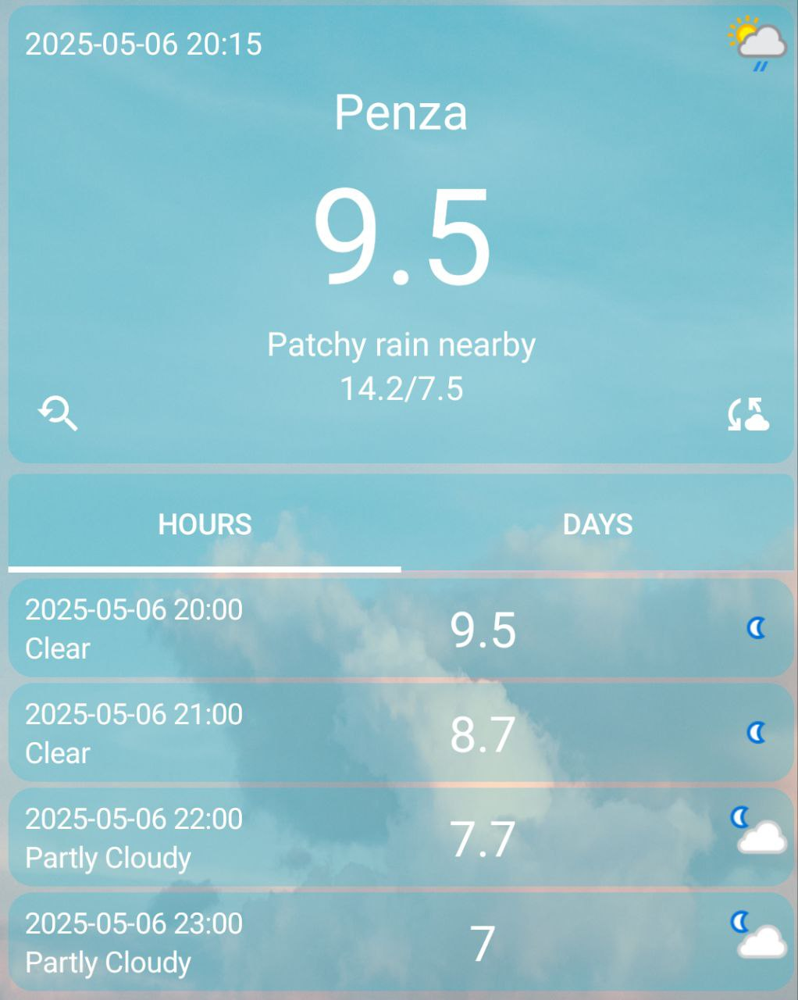

# Weather Forecast

**Weather Forecast** — Android-приложение, которое показывает текущую погоду, почасовой и 7-дневный прогноз для выбранного города.  
Интерфейс написан на **Jetpack Compose**.

---

## Требования

| Софт / инструмент          | Мин. версия |
|----------------------------|-------------|
| **Android Studio**         | Hedgehog (2024.1.1) |
| **Kotlin**                 | 1.9 + |
| **Gradle (plugin)**        | 8.x |
| **Android SDK**            | minSdk 21 · targetSdk 34 |
| **WeatherAPI key**         | задаётся в константе `API_KEY` внутри `MainActivity.kt`

---

## Ключевые возможности

| Категория            | Возможность |
|----------------------|-------------|
| Текущее состояние    | Отображает температуру и описание для выбранного города |
| Почасовой прогноз    | Вкладка **HOURS** показывает будущие часы (фильтр по текущему времени) |
| 7-дневный прогноз    | Вкладка **DAYS** выводит прогноз на неделю (7 дней) |
| Выбор города         | Модальное окно со списком предустановленных городов, сохранение выбора |
| Ручное обновление    | Кнопка-обновление вызывает новый запрос к API и показывает Snackbar «Updated!» |

---

## 🛠️ Стек технологий

- **Kotlin + Jetpack Compose** (Material 3)
- **Volley** — HTTP клиент
- **Coil** — асинхронная загрузка и кэш иконок
- **org.json** — парсинг JSON
- **Compose Canvas API** — кастомный чарт
- **Coroutines / State** — реактивное хранение данных UI

---
## Скриншоты работы

